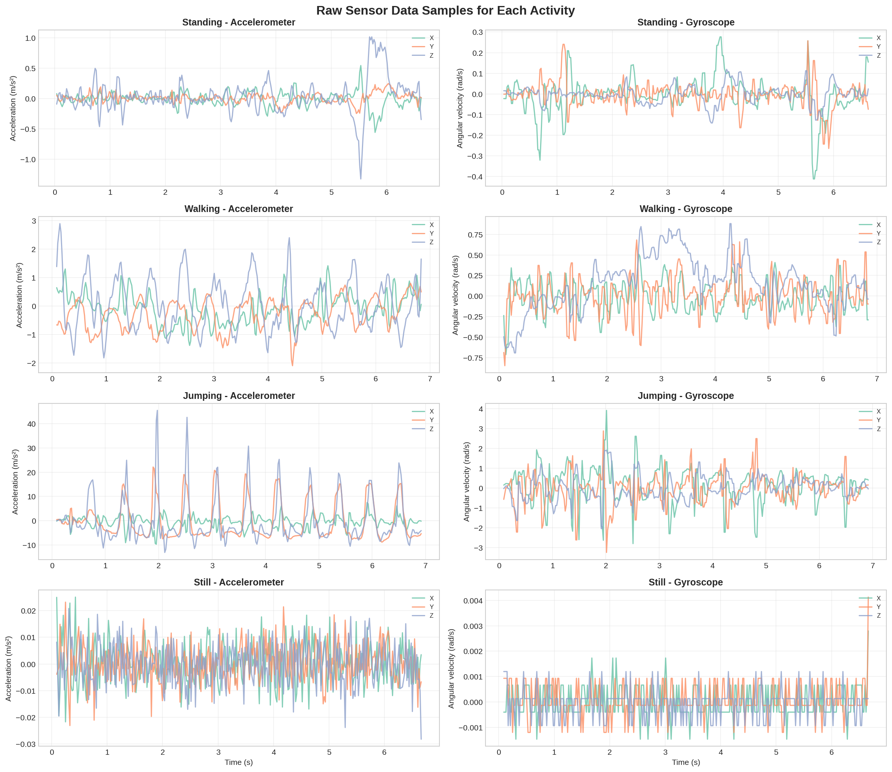
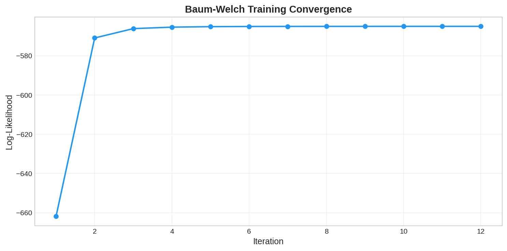
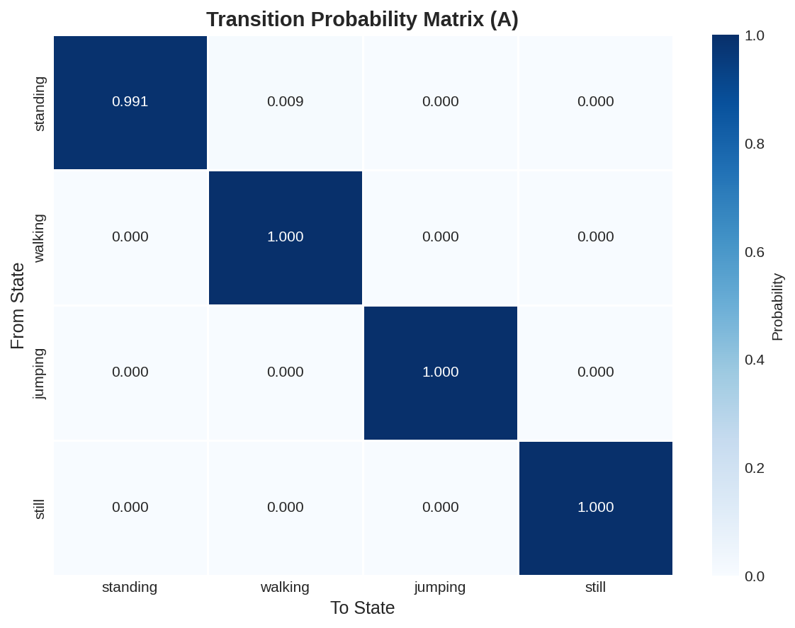
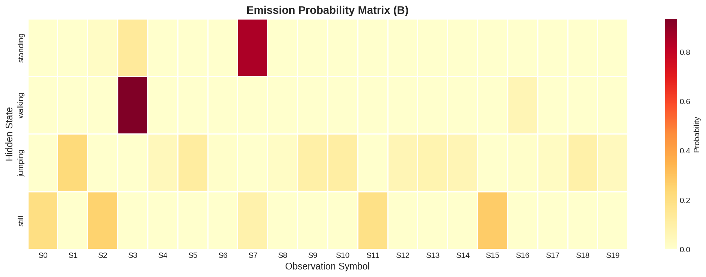
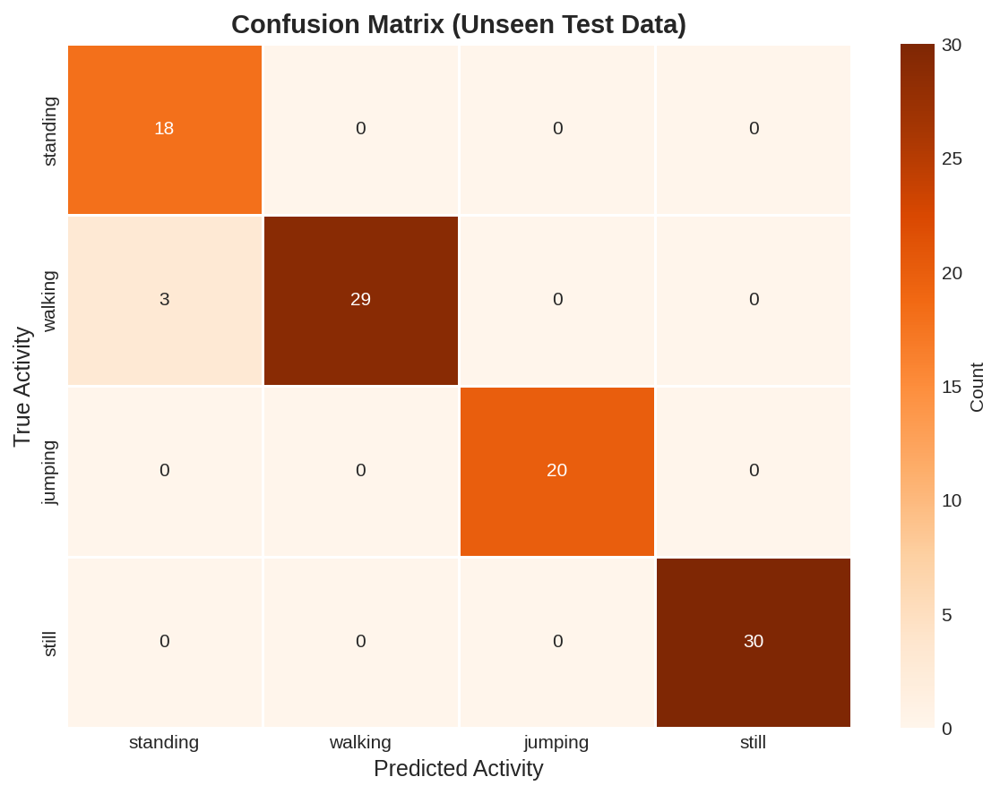
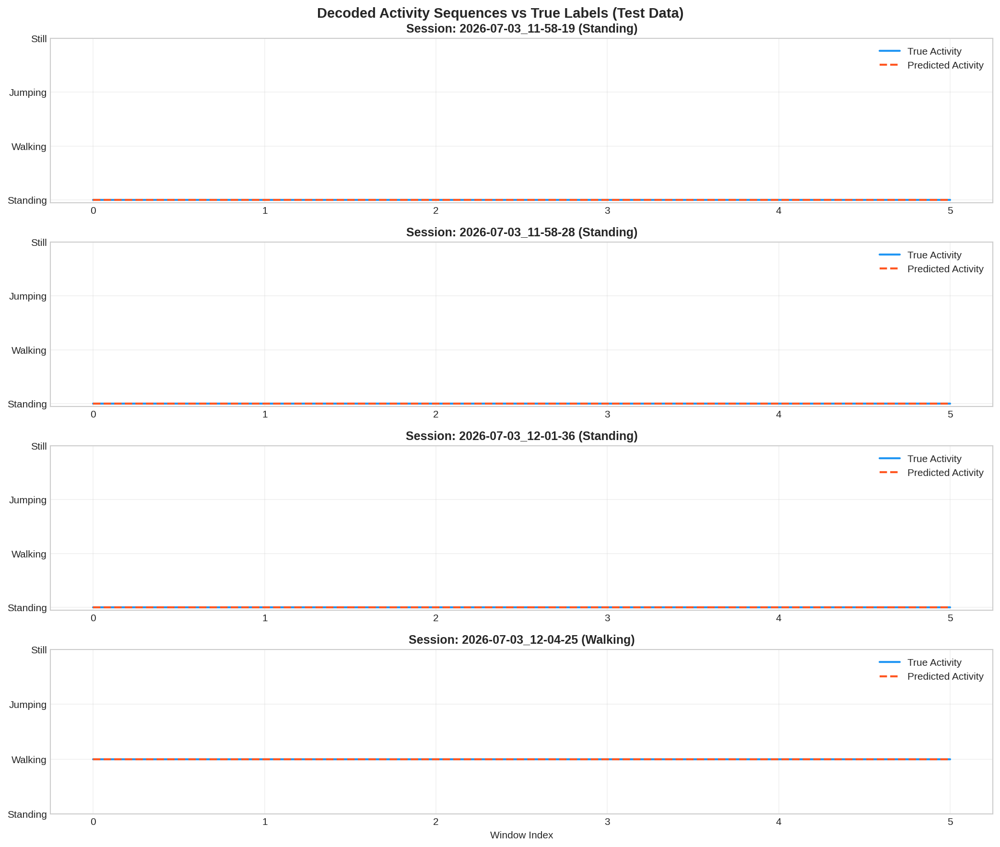

# Modeling Human Activity States Using Hidden Markov Models

**Author:** Samuel Mwania  
**Date:** July 2026  
**Course:** Formative 2 - Hidden Markov Models

---

## Project Overview

This project uses a **Hidden Markov Model (HMM)** built from scratch to classify four human activities (standing, walking, jumping, and still) from smartphone accelerometer and gyroscope data. The model was trained using the **Baum-Welch algorithm** and decoded using the **Viterbi algorithm**, both implemented manually with NumPy.

**Use Case:** Personal Fitness and Rehabilitation Monitoring

---

## Repository Structure

```
hmms/
├── hmm_activity_recognition.ipynb   # Main notebook (complete pipeline)
├── data/
│   ├── standing/                    # 20 recording sessions
│   ├── walking/                     # 20 recording sessions
│   ├── jumping/                     # 20 recording sessions
│   └── still/                       # 20 recording sessions
├── raw_sensor_data.png              # Raw signal visualization
├── convergence_plot.png             # Baum-Welch convergence
├── transition_matrix.png            # Transition probability heatmap
├── emission_matrix.png              # Emission probability heatmap
├── confusion_matrix.png             # Confusion matrix on test data
├── decoded_sequences.png            # Viterbi decoded vs true labels
└── README.md                        # This file
```

---

## Data Collection

- **App:** Sensor Logger (Android)
- **Device:** CPH2573 (Android)
- **Sampling Rate:** 50 Hz
- **Total Files:** 80 CSV files (20 per activity)
- **Duration:** Each file is approximately 6-7 seconds

| Activity | Description | Files | Total Duration |
|----------|-------------|-------|----------------|
| Standing | Phone held steady at waist level | 20 | ~2.3 min |
| Walking | Consistent walking pace | 20 | ~2.3 min |
| Jumping | Continuous vertical jumps | 20 | ~2.3 min |
| Still | Phone flat on a table | 20 | ~2.3 min |

### Raw Sensor Data



---

## Feature Extraction

38 features were extracted per 1-second window:

- **Time-domain (5 per axis):** Mean, Variance, Standard Deviation, RMS, Signal Magnitude Area
- **Frequency-domain (2 per axis):** Dominant Frequency (FFT), Spectral Energy
- **Cross-axis (1):** Accelerometer XY Correlation

All features were normalized using Z-score standardization and discretized into 20 symbols using K-Means clustering.

---

## HMM Architecture

| Component | Details |
|-----------|---------|
| Hidden States | 4 (Standing, Walking, Jumping, Still) |
| Observation Symbols | 20 (from K-Means quantization) |
| Training Algorithm | Baum-Welch (EM) with log-likelihood convergence check |
| Decoding Algorithm | Viterbi (log-space) |
| Convergence Threshold | 0.001 |

### Training Convergence



---

## Model Parameters

### Transition Probability Matrix



### Emission Probability Matrix



---

## Evaluation Results

The model was tested on 20% of sessions (16 sessions, 100 windows) that were never seen during training.

### Confusion Matrix



### Performance Metrics

| State (Activity) | Samples | Sensitivity | Specificity | Overall Accuracy |
|-------------------|---------|-------------|-------------|------------------|
| Standing | 18 | 100.00% | 96.34% | 97.00% |
| Walking | 32 | 90.62% | 100.00% | 97.00% |
| Jumping | 20 | 100.00% | 100.00% | 100.00% |
| Still | 30 | 100.00% | 100.00% | 100.00% |

**Overall Model Accuracy: 97.00%**

### Decoded Activity Sequences



---

## How to Run

1. Clone this repository
2. Make sure Python 3 is installed with the following packages:
   ```
   numpy, pandas, matplotlib, seaborn, scipy, scikit-learn
   ```
3. Open the notebook:
   ```bash
   jupyter notebook hmm_activity_recognition.ipynb
   ```
4. Run all cells from top to bottom

---
